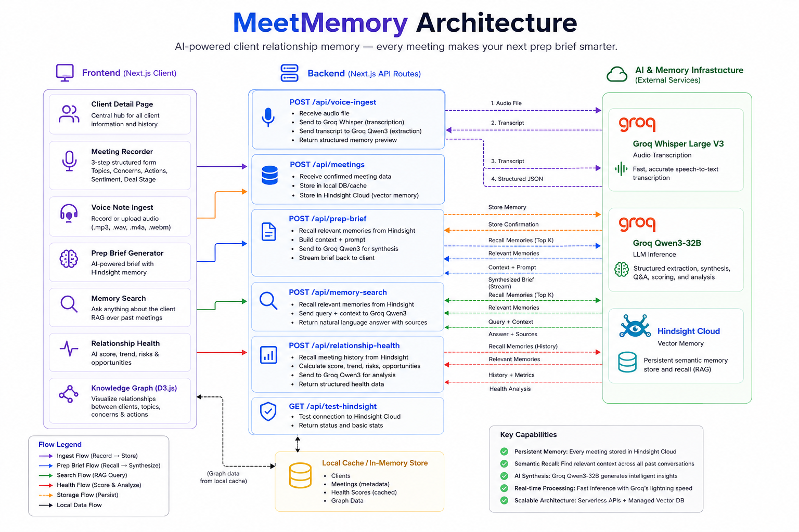

# MeetMemory 🧠

> AI-powered client relationship memory — every meeting makes your next prep brief smarter.

## Screenshot

_Add a demo screenshot or recording here after recording your demo._

---

## Why MeetMemory

Traditional AI assistants forget previous interactions.

MeetMemory uses Hindsight as a persistent memory layer, allowing the agent to learn from every meeting, recall historical context, and generate increasingly personalized meeting preparation.

The more meetings stored, the smarter the briefing becomes.

---

## Features

| Feature | Description |
|---|---|
| 🎙️ **Meeting Recorder** | Structured 3-step form — topics, concerns, action items, sentiment, deal stage |
| 🎤 **Voice Note Ingest** | Record or upload audio → Whisper transcribes → Groq extracts structured memory |
| 🧠 **AI Prep Brief** | Hindsight recall + LLM synthesis generates a sharp, context-aware briefing doc |
| ⚡ **Before/After Demo Mode** | Side-by-side comparison: generic AI vs Hindsight-powered brief |
| 🔍 **Inline Memory Search** | Ask anything about a client — RAG over Hindsight returns cited answers |
| 📊 **Relationship Health** | AI scores (0-100) with sparkline, trend, deal momentum, top risks & opportunities |
| 🕸️ **Knowledge Graph** | D3 force-directed graph of all clients, topics, concerns, and action items |
| 🌱 **Demo Seed** | One-click seed of 4 realistic meetings for any client (dev/`?demo=true`) |

---

## Architecture

## Architecture Diagram



```
Browser (Next.js App Router)
│
├── /clients                  → Client list + New Client dialog
├── /clients/[id]             → Detail page
│   ├── Timeline              → Expandable meeting cards, sentiment dots
│   ├── VoiceNoteRecorder     → MediaRecorder → /api/voice-ingest
│   ├── MemorySearch          → /api/memory-search  (Hindsight recall + Groq)
│   └── RelationshipHealth    → /api/relationship-health (Hindsight + Groq scoring)
├── /clients/[id]/prep        → Prep brief page
│   └── Demo Mode             → Cold vs Hot side-by-side
└── /graph                    → D3 knowledge graph
│
API Routes (Next.js Route Handlers)
│
├── POST /api/meetings         → storeMemory() + createMeeting()
├── POST /api/voice-ingest     → Whisper → Groq extraction
├── POST /api/prep-brief       → recallMemories() → Groq synthesis
├── POST /api/prep-brief-cold  → Groq synthesis (no memory, for demo)
├── POST /api/memory-search    → recallMemories() → Groq Q&A
└── POST /api/relationship-health → recallMemories() → Groq health score
│
Memory Layer
│
└── src/lib/hindsight.ts
    ├── storeMemory(content, clientId)    → Hindsight SDK / mock
    └── recallMemories(query, clientId)   → Hindsight semantic search
```

---

## How Hindsight is Used

MeetMemory uses [Hindsight](https://hindsight.so) as its semantic memory layer. Every meeting is stored as a rich text memory with a `clientId` metadata filter. On retrieval, Hindsight returns the most relevant memories using vector similarity.

### Store

```ts
// src/lib/hindsight.ts
await client.store({
  content: `Meeting #${meetingNumber} with ${clientName}...`,
  metadata: { clientId, meetingId, sentiment, dealStage },
});
```

### Recall

```ts
// Recall top-10 memories for a client, sorted by recency
const memories = await recallMemories(
  `${clientName} meeting history concerns action items`,
  clientId,
  10
);
```

The recalled memories are then passed as structured context to Groq's `qwen/qwen3-32b` for synthesis.

---

## Tech Stack

| Layer | Technology |
|---|---|
| Framework | Next.js 16 (App Router, TypeScript) |
| Styling | Tailwind CSS + shadcn/ui (zinc base) |
| Memory | Hindsight Cloud |
| LLM | Groq (`qwen/qwen3-32b`) |
| Transcription | Groq Whisper Large V3 |
| Graph | D3.js v7 (force-directed) |
| Persistence | localStorage + in-memory Map |
| Toasts | Sonner |
| Icons | Lucide React |

---

## Setup

```bash
# 1. Clone the repo
git clone https://github.com/your-username/meetmemory
cd meetmemory/meetmemory

# 2. Install dependencies
npm install

# 3. Configure environment
cp .env.local.example .env.local
# Edit .env.local and add your keys:
#   GROQ_API_KEY=gsk_...
#   HINDSIGHT_API_KEY=...  (optional — mock works without it)
#   NEXT_PUBLIC_APP_URL=http://localhost:3000

# 4. Start the dev server
npm run dev
```

Open [http://localhost:3000](http://localhost:3000).

---

## Demo Walkthrough

1. **Add a client** → `/clients` → New Client
2. **Seed demo data** → client detail page → `🌱 Seed Demo Data` (or add `?demo=true` to URL in production)
3. **Explore the timeline** → expand meeting cards to see Hindsight memory IDs
4. **Search memory** → type a question in the search bar (e.g. _"What are their biggest concerns?"_)
5. **Generate prep brief** → click **Prepare** → watch the Hindsight retrieval status live
6. **Demo Mode** → toggle Before/After to show the difference memory makes
7. **Calculate health** → sidebar → **Calculate Health** → see score, sparkline, risk/opportunity
8. **View the graph** → `/graph` — drag nodes, filter by type, click to explore

---

## Demo Link

_Add your deployed URL here._

---

## Environment Variables

```bash
GROQ_API_KEY=           # Required — get from console.groq.com
HINDSIGHT_API_KEY=      # Required
NEXT_PUBLIC_APP_URL=    # Optional — defaults to http://localhost:3000
```
